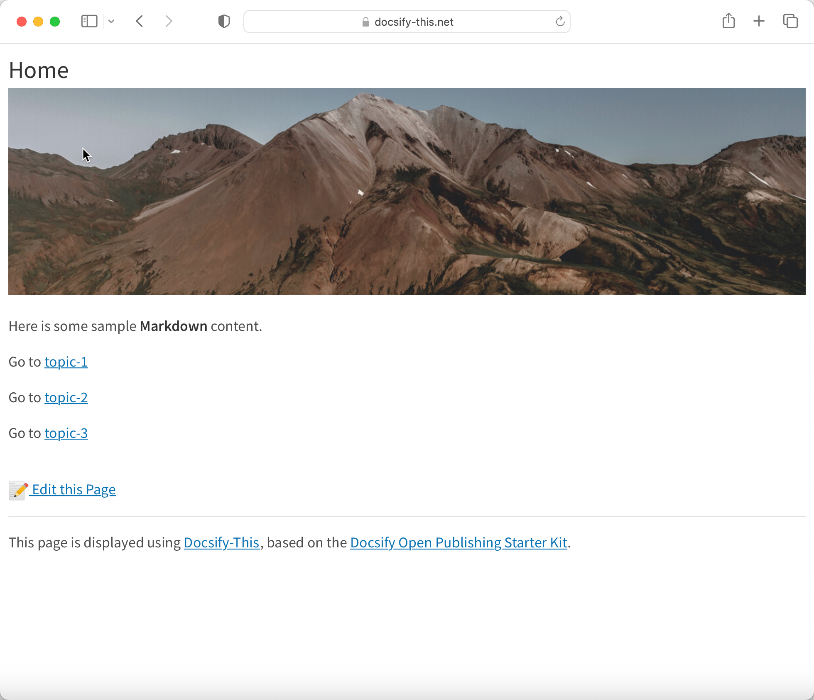

# Docsify-This Multiple Page Site Template

> This is a multiple page site template for use with [Docsify-This.net](https://docsify-this.net/#/).

_Figure 1. Docsify-This Multiple Page Site Template. Explore the resulting standalone web site generated by Docsify-This.net at [https://paulhibbitts.github.io/test-docsify-this/?basePath=https://raw.githubusercontent.com/paulhibbitts/docsify-this-multiple-page-site/main&homepage=home.md](https://paulhibbitts.github.io/test-docsify-this/?basePath=https://raw.githubusercontent.com/paulhibbitts/docsify-this-multiple-page-site/main&homepage=home.md)_

How to Use
---

1. Tap **Use this template** in this repository (upper-right green button) and then choose **Create a new repository**

2. Choose the name for your new repository to contain the files and then tap **Create repository from template**

3. View the **home.md** Markdown file in your newly created repository and copy it's URL

4. Go to https://docsify-this.net and paste the copied URL into the **Markdown File URL** field

5. Tap the **View as Standalone Page** button to view your Markdown files as a web site

You can further customize the appearance of your web pages by tapping on the **Show More Page Options »** link in the Docsfy-This Web Page Builder.

Docsify-This Examples
---

[Docsify-This Multiple Page Site Template](https://github.com/paulhibbitts/docsify-this-multiple-page-site), displayed by Docsify-This as a:  
* [Standalone Web Site](https://paulhibbitts.github.io/test-docsify-this/?basePath=https://raw.githubusercontent.com/paulhibbitts/docsify-this-multiple-page-site/main&homepage=home.md "Standalone Web Site")  
* [Standalone Web Site and 'Edit this Page' links](https://paulhibbitts.github.io/test-docsify-this/?basePath=https://raw.githubusercontent.com/paulhibbitts/docsify-this-multiple-page-site/main&homepage=home.md&edit-link=https://github.com/paulhibbitts/docsify-this-multiple-page-site/blob/main/home.md "Standalone Web Site and 'Edit this Page' links")  
* [Standalone Web Site with Docsify Navbar](https://paulhibbitts.github.io/test-docsify-this/?basePath=https://raw.githubusercontent.com/paulhibbitts/docsify-this-multiple-page-site/main&homepage=home.md&loadNavbar=_navbar "Standalone Web Site with Docsify Navbar")
* [Standalone Web Site with Docsify Navbar and 'GitHub Repository' link](https://paulhibbitts.github.io/test-docsify-this/?basePath=https://raw.githubusercontent.com/paulhibbitts/docsify-this-multiple-page-site/main&homepage=home.md&homepage=home.md&loadNavbar=_navbar&edit-link=https://github.com/paulhibbitts/docsify-this-multiple-page-site&edit-link-text=GitHub%20Repository "Standalone Web Site with Docsify Navbar and 'View GitHub Repository' link")
